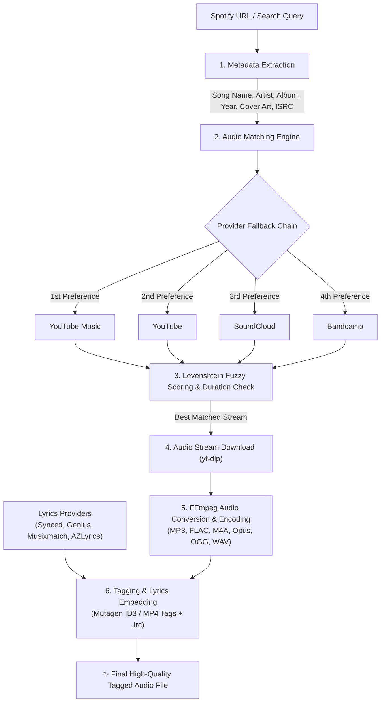

<div align="center">

# 🎵 OtoFetch

**Fast, lightweight, and accurate terminal music downloader for Spotify.**

[](https://github.com/OTAKUWeBer/OtoFetch/blob/main/LICENSE)
[](https://github.com/OTAKUWeBer/OtoFetch)
[](https://github.com/OTAKUWeBer/OtoFetch)
[](https://github.com/OTAKUWeBer/OtoFetch)

> Finds tracks, albums, and playlists from Spotify, matches audio across high-quality providers (YouTube Music, YouTube, SoundCloud, Bandcamp), and encodes them with embedded album art, synced lyrics, and metadata.

</div>

---

## 📖 How It Works

OtoFetch downloads music using an intelligent multi-stage pipeline:



### Detailed Pipeline Stages:
1. **Metadata Extraction**: OtoFetch queries Spotify's catalog to extract precise track metadata: Title, Artists, Album, Release Date, Track/Disc Numbers, Genres, ISRC code, and high-resolution cover art.
2. **Smart Audio Matching Engine**: Generates optimized search queries and scores candidate tracks against the Spotify metadata using Levenshtein distance, duration tolerance checks, and strict filtering of noise terms (such as *"remix"*, *"bassboosted"*, *"live"*, *"slowed"*, etc.).
3. **High-Quality Stream Retrieval**: Uses `yt-dlp` to download the original high-bitrate audio stream from the highest-scoring candidate.
4. **Encoding via FFmpeg**: Transcodes the downloaded stream to your preferred audio container (`mp3`, `flac`, `m4a`, `opus`, `ogg`, `wav`) with custom or maximum bitrate.
5. **Tagging & Synced Lyrics**: Uses `mutagen` to embed full ID3v2/MP4 tags, album artwork, and time-stamped synced lyrics (`.lrc`).

---

## ✨ Features

- 🚀 **Pure Terminal Speed**: Built for developers and CLI lovers—zero bloated Web UIs or heavy frameworks.
- 🎯 **Pinpoint Audio Matching**: Advanced algorithms match Spotify tracks to YouTube Music/YouTube/SoundCloud with high accuracy.
- 🎨 **Rich Terminal Interface**: Beautiful real-time progress bars, track stats, color-coded logging, and download speeds.
- 🔄 **Smart Syncing**: Automatically keep local music folders synchronized with your favorite Spotify playlists.
- 🎶 **Synced Lyrics**: Embedded timed lyrics and standalone `.lrc` file generation support.
- 🎛️ **Format Flexibility**: Output in MP3 (up to 320kbps), Lossless FLAC, AAC/M4A, Opus, OGG, or WAV.
- ⚡ **Modern Tooling**: Full dual-support for ultra-fast package manager `uv` and standard `pip`.

---

## ⚡ Installation

### Option A: Using `uv` (Recommended & Fastest ⚡)

```bash
git clone https://github.com/OTAKUWeBer/OtoFetch.git
cd OtoFetch

# Install in editable mode:
uv pip install -e .

# Or run on the fly:
uv run otofetch [query]
```

### Option B: Using standard `pip`

```bash
git clone https://github.com/OTAKUWeBer/OtoFetch.git
cd OtoFetch

pip install .
# Or install dependencies via requirements.txt:
pip install -r requirements.txt
```

---

### 📦 Optional Helper Binaries (FFmpeg & Deno)

OtoFetch requires **FFmpeg** for audio conversion. If FFmpeg or Deno is not installed globally on your machine, OtoFetch can download them automatically into its local directory:

```bash
otofetch --download-ffmpeg
otofetch --download-deno
```

---

## 🚀 Usage Guide

### 1. Download Tracks, Albums & Playlists

```bash
# Download a single track
otofetch "https://open.spotify.com/track/4cOdK2wGLETKBW3PvgPWqT"

# Download an entire album
otofetch "https://open.spotify.com/album/4m28RiFDihEjKNJ4qpmXsA"

# Download a playlist
otofetch "https://open.spotify.com/playlist/37i9dQZF1DXcBWIGoYBM5M"

# Download using search terms (no URL needed)
otofetch "Never Gonna Give You Up"
otofetch "artist:The Weeknd album:After Hours"
```

---

### 2. Available Operations

```bash
otofetch [operation] [options] QUERY
```

| Operation | Description | Example |
|---|---|---|
| `download` *(default)* | Downloads tracks and embeds high-resolution metadata and art. | `otofetch download "URL"` |
| `sync` | Syncs a local folder with a playlist (downloads new, removes deleted). | `otofetch sync "URL" --save-file playlist.otofetch` |
| `save` | Saves metadata list to `.otofetch` file without downloading audio. | `otofetch save "URL" --save-file list.otofetch` |
| `meta` | Updates metadata and album art for existing local audio files. | `otofetch meta "song.mp3"` |
| `url` | Prints matched stream download URLs to stdout. | `otofetch url "URL"` |

---

### 3. Custom Output Formatting & Quality

Specify where and how files should be saved using template variables:

```bash
# Custom directory layout: Music/Artist/Album/01 - Title.mp3
otofetch "PLAYLIST_URL" --output "Music/{album-artist}/{album}/{track-number} - {title}.{output-ext}"

# Download in Lossless FLAC
otofetch "TRACK_URL" --format flac

# Generate synced lyrics (.lrc)
otofetch "PLAYLIST_URL" --generate-lrc

# Use 8 parallel download threads for faster downloads
otofetch "PLAYLIST_URL" --threads 8
```

#### Available Output Template Variables:
`{title}`, `{artists}`, `{artist}`, `{album}`, `{album-artist}`, `{genre}`, `{disc-number}`, `{disc-count}`, `{duration}`, `{year}`, `{original-date}`, `{track-number}`, `{tracks-count}`, `{isrc}`, `{track-id}`, `{output-ext}`, `{list-name}`

---

## ⚙️ Configuration & Options

| Argument | Description |
|---|---|
| `--format` | Output audio format: `mp3`, `flac`, `m4a`, `opus`, `ogg`, `wav` (default: `mp3`). |
| `--bitrate` | Bitrate setting: `auto`, `320k`, `256k`, `192k`, `128k`, or variable `0`-`9`. |
| `--audio` | Ordered audio providers fallback list: `youtube-music`, `youtube`, `soundcloud`, `bandcamp`. |
| `--lyrics` | Lyrics providers: `synced`, `genius`, `musixmatch`, `azlyrics`. |
| `--generate-lrc` | Generates a standalone `.lrc` file containing synchronized lyrics. |
| `--m3u` | Generates an `.m3u8` playlist file for the downloaded songs. |
| `--threads` | Number of simultaneous download threads (default: `4`). |
| `--overwrite` | Behavior for existing files: `skip`, `metadata`, `force`. |
| `--cookie-file` | Path to a Netscape format cookies file for premium YouTube / Spotify access. |
| `--config` | Load options from `~/.config/otofetch/config.json` (Linux) or `%USERPROFILE%\.otofetch\config.json` (Windows). |
| `--generate-config` | Creates a default `config.json` file. |

---

## 🤝 Acknowledgments & Fork Credit

**OtoFetch** is a streamlined, pure terminal CLI fork maintained by [OTAKUWeBer](https://github.com/OTAKUWeBer).

Sincere gratitude and credit to the original creators and contributors of the [spotDL](https://github.com/spotDL/spotify-downloader) project for their foundational work and audio matching concepts.

---

## 📄 License

This project is open source and licensed under the [MIT License](LICENSE).
